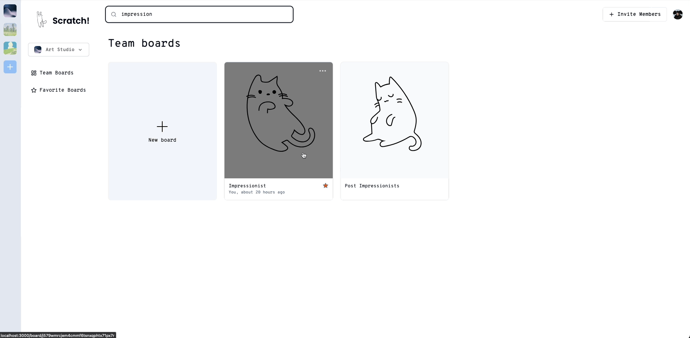
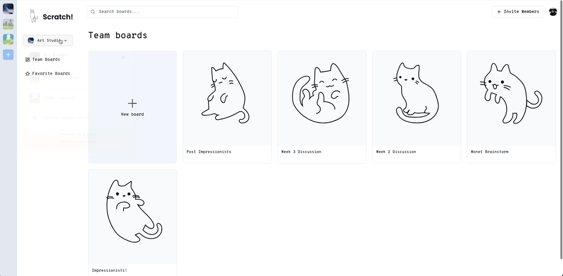
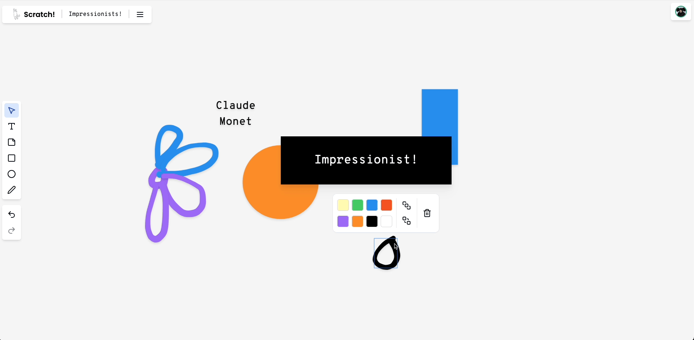
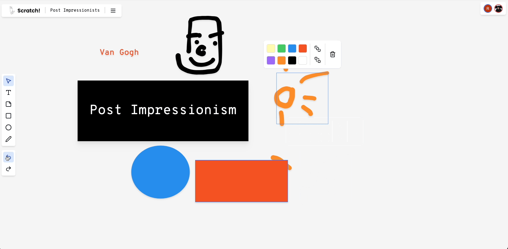
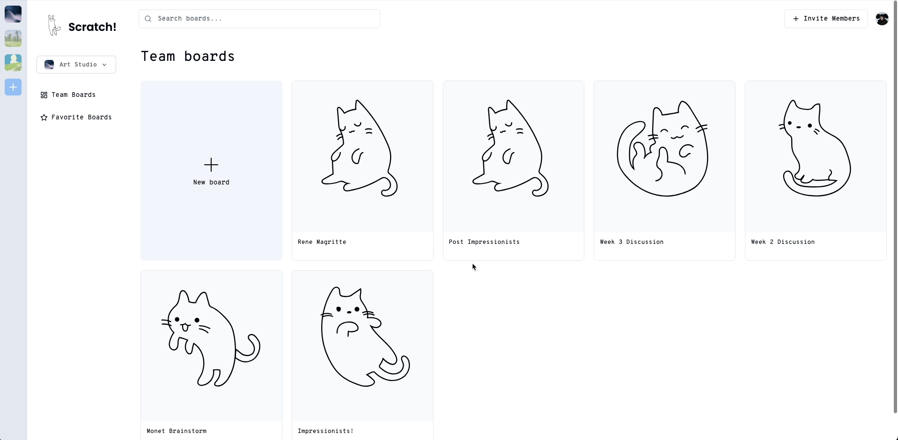
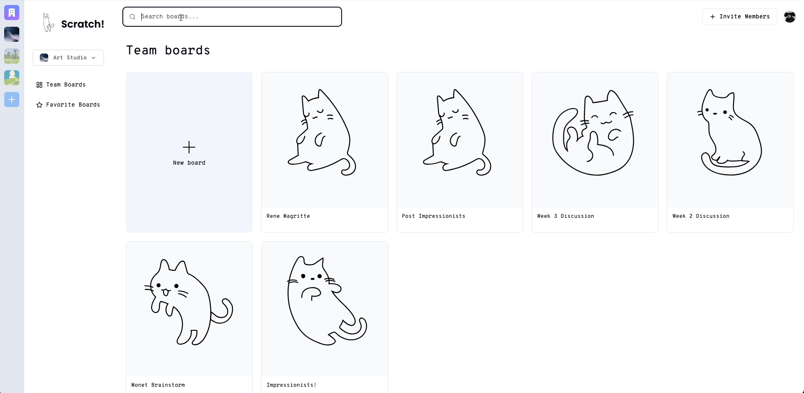
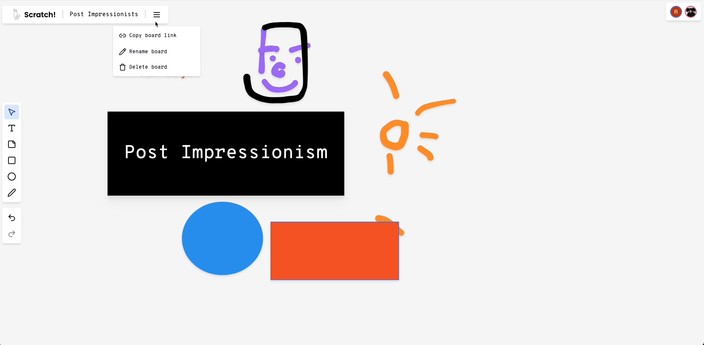

# ✨ Scratch! - Real-Time Collaborative Space

Welcome to [Scratch!](https://scratch.social), a delightful Miro-inspired app that invites you to unleash your creativity and collaborate with others in real-time. Built with modern web technologies, Scratch! provides a cozy and intuitive space for brainstorming, planning, and bringing ideas to life.

## 🛠️ Tech Stack
### Frontend
- **Framework**: Next.js
- **Language**: TypeScript
- **Styling**: Tailwind CSS
- **Real-time Collaboration**: Liveblocks
- **UI Components**: shadcn/ui, Lucide React
- **Data Fetching**: SWR

### Backend
- **Database**: Convex
- **Authentication**: Clerk
- **Deployment**: Vercel

## 🎨 Key Features
### Real-time Collaboration
Experience the joy of seamless teamwork as you watch ideas unfold together in real-time. Scratch! enables multiple users to collaborate on the same canvas, seeing each other's changes instantly.

### Intuitive Tools
Scratch! offers a range of intuitive tools to help you express your ideas effortlessly. From drawing and erasing to adding sticky notes and connectors, everything you need is at your fingertips.
#### SVG Pencils
   
#### Undo Redo
 

### Indexing
#### Favorite Boards
Keep your most important boards easily accessible by marking them as favorites.

#### Search Functionality
Find the content you need quickly with the search feature. Easily locate specific boards within your workspace.

### Organization and Board Management
Scratch! provides a user-friendly interface for organizing and managing your boards. Easily create new boards, rename existing ones, and keep your workspace tidy.

 

## Try it
Simply give the app a try [here](scratch.social) and start collaborating with your team today!

Happy scratching! 🎉

## Acknowledgment
https://thenounproject.com/creator/uyuuuuu/

https://thenounproject.com/creator/just904/
